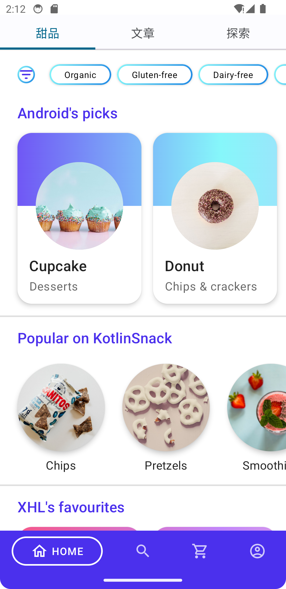
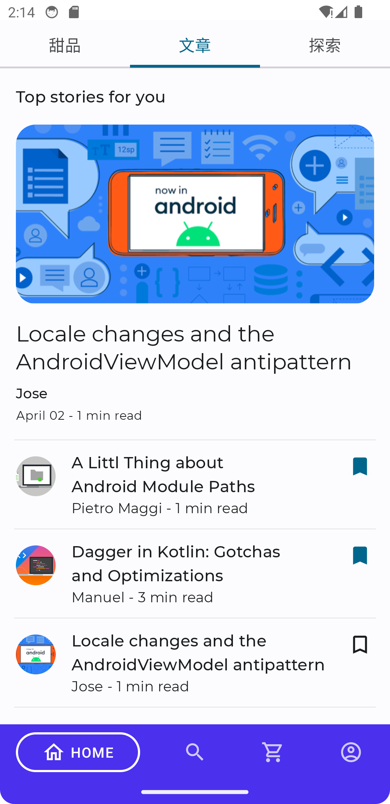

# JansiSnack

## 项目说明

项目使用最新的技术栈（后端使用Java17、SpringBoot3.0、SpringCloud、Golang Echo，前端使用Android JetPack Compose），一个简单的甜品购买app，提供新闻资讯
登录注册、个人资料编辑等功能。

## 主要特性

* 持久层使用SpringData JPA结合Mybatis Plus混合开发，能够支持多种数据库适配
* 使用Redis实现购物车模型以及分布式锁
* 使用Kafka实现订单的实时高速处理
* 使用Nginx作为反向代理服务器实现静态资源的存储以、缓存以及请求限流
* 调用Google和Baidu的api实现定位功能
* 通过Spring Cloud Gateway、Spring MVC、Nginx协同提供安全防护和高可用性
* 新闻资讯模块使用Golang Echo构建并以MongoDB为持久层
* 会话通过数据库作为二级缓存，即使重启也不会丢失登录状态
* 所有的接口都有端到端的测试用例覆盖，有代码变动都会全量跑一遍测试用例，保证功能绝对可用
* 统一对象存储封装，实现应用和上传文件位置隔离，支持本地上传&所有符合S3标准（阿里云、华为云、MinIO等）的对象存储

## 项目预览

<table>
    <tr>
        <td></td>
        <td></td>
    </tr>
    <tr>
        <td></td>
        <td></td>
    </tr>
    <tr>
       <td></td>
       <td></td>
    </tr>
     <tr>
       <td></td>
       <td></td>
    </tr>
</table>

## 软件需求

- JDK 17
- Golang 1.20
- Redis 7.2
- Kafka 2.13-3.6.0
- Nginx 1.21
- MySQL 8.0
- Maven 3.6.0+

## 本地部署

- 通过git下载源码
- 创建数据库admin3，数据库编码为UTF-8
- 修改application.yml文件，更改MySQL账号和密码

## 待办列表

- [x] "探索模块"

- [x] 文章发布功能

- [ ] 国际化

- [ ] 更多功能请 [Issues](https://github.com/cjbi/admin3/issues) 留言

欢迎参与项目贡献！

## 许可证

[MIT](LICENSE)
