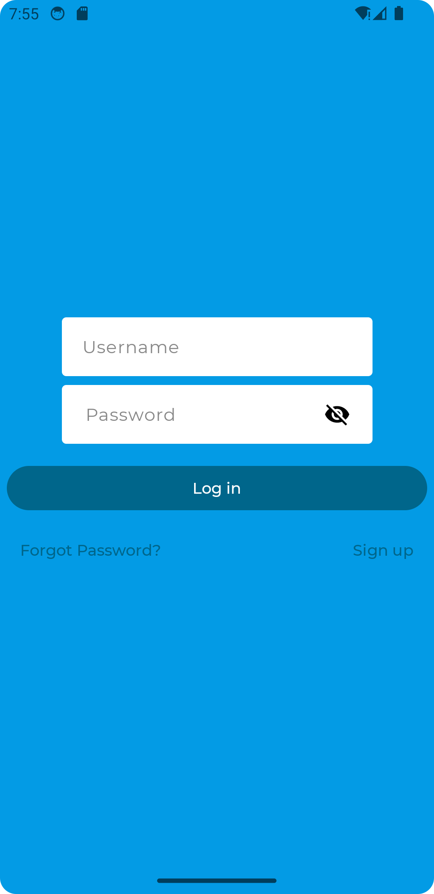
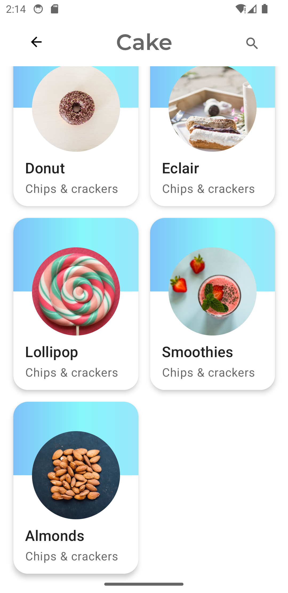

# JansiSnack

## 项目说明

一个简单的甜品购买app，提供常见的电商和新闻资讯类应用功能。

## 主要特性
* 后端使用SpringBoot、SpringCloud、Golang Echo等主流框架构建
* 前端使用Android JetPack Compose开发实现
* 使用Retrofit实现前后端的数据交互并使用Room数据库实现应用端缓存
* 持久层使用SpringData JPA结合Mybatis Plus混合开发，能够支持多种数据库适配
* 提供登录注册功能，并使用MD5进行密码加密
* 使用Redis实现甜品数据的缓存、购物车模型以及分布式锁
* 使用Kafka实现订单的实时高速处理
* 使用Nginx作为反向代理服务器实现静态资源的存储、缓存以及请求限流
* 调用Google和Baidu的api实现定位功能
* 通过Spring Cloud Gateway、Spring MVC、Nginx协同提供安全防护和高可用性
* 使用Seata处理订单场景中的分布式事务
* 新闻资讯模块使用Golang Echo构建并以MongoDB为持久层并使用Websocket技术实现收藏功能的ui实时更新，符合单向数据流动原则
* 附带docker Compose文件，实现容器快速部署
* 统一对象存储封装，实现应用和上传文件位置隔离，支持本地上传&所有符合S3标准（阿里云、华为云、MinIO等）的对象存储

## 项目预览

<table>
    <tr>
        <td></td>
        <td></td>
        <td></td>
    </tr>
    <tr>
        <td></td>
        <td></td>
        <td></td>
    </tr>
     <tr>
       <td></td>
       <td></td>
       <td></td>
    </tr>
     <tr>
       <td></td>
       <td></td>
       <td></td>
    </tr>
</table>

## 软件需求

- JDK 17
- Kotlin 1.9.22
- Golang 1.20
- SpringFramework 6.0.15
- Springboot 3.1.7
- SpringCloud 4.0.4
- Golang Echo 4.1.17
- Redis 7.2
- Kafka 2.13-3.6.0
- Nginx 1.21
- MySQL 8.0
- Maven 3.6.0+
- Gradle 8.4
- MongoDB 7.0

## 本地部署

- 通过git下载源码
- 创建数据库dessert和orderservice，数据库编码为UTF8mb4
- 修改所有Java微服务中的application.yml文件，更改MySQL账号和密码，redis以及Kafka端口
- 修改Nginx配置文件upstream httpget部分的Server端口为你的主机ip地址
- 修改Kotlin-Android/JansiSnack_Front/app/src/main/java/com/example/jetsnack/api/DessertService.kt目录下的BASE_URL和ARTICLE_BASE_URL，分别修改成你的主机ip地址
- 本地（或虚拟机）启动Nacos、redis、Kafka、Nginx（请注意Nacos和Kafka为单机模式）

## 待办列表

- [ ] "探索模块"
- [ ] 文章发布功能
- [ ] 商户端模块
- [ ] 国际化

- [ ] 更多功能请 [Issues](https://github.com/cjbi/admin3/issues) 留言

欢迎参与项目贡献！
